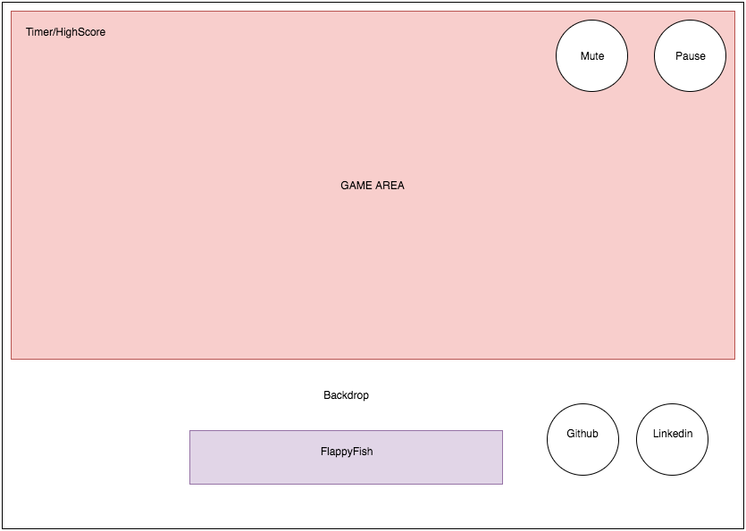

## FlappyFish

### Background

This game will be an infinite runner type game based on Flappy Bird, a side-scroller game where the player controls a bird. The purpose of the game is to fly between rows of green pipes without hitting them. By the end of 2014, FlappyBird was the most downloaded game in the iOS App Store.

FlappyFish is a one to two player game, that will utilize a 'game window' (most likely HTML 5 canvas element/easel.js?) for most of the game functionality, where the player will control a "Fish". The rules of the games are as follows:

1. The user earns points over time.
2. The user has one life. Lives are lost by bumping into obstacles.
3. Obstacles are positioned in the ocean, and users must swim between these obstacles to avoid them.
4. Players are able to obtain power-ups

5. Scaling difficulty(bonus)
6. Two player functionality(bonus)

## Functionality & MVP  

### In game Functionality
Players will:

- Have a score based on the progression of the game
- Swim through water
- Collect smaller fish for power-ups
- Leaderboard(Not 100% sure)

### Ancillary Functionality
FlappyFish players will be able to (outside of the in-game):

- Pause the game
- Toggle the volume of the background music and sound effects
- Restart the game
- An About modal describing the background and rules of the game
- A production Readme

## Wireframes
FlappyFish will be run on a single page, with a game window. Additionally, this page will contain links to my Linkedin and Github.

## Architecture and Technologies

- JavaScript for the game logic
- Jquery for certain button inputs (or maybe my own GrabJS library)
- `Easel.js` with `HTML5 Canvas` for DOM manipulation and rendering
- Webpack for bundling

- PXloader?
- Query sprite animation library?

The following scripts will be used in this project:
- fish.js - this will keep track of the vehicle object and will be partly responsible for any collisions
- board.js - this will be used for the board and the platform logic
- obstacle.js - this will be used for rendering all of the obstacles
- power-up.js - this will be used for rendering the power cubes

### Implementation Timeline

**Day 1**:
Setup the "game window". This would include the HTML5 canvas, and the platforms. Start working on rendering the obstacles, the fish, and the power ups.

**Day 2**:
Add collisions between the fish and the obstacles.

**Day 3**:
Add a scoring system that will update as intended. Get sound effects.

**Day 4**:
Install the controls for user to interact with the game. Style the frontend, make it polished and professional.

## Bonus features

5. Scaling difficulty(bonus)
6. Two player functionality(bonus)
